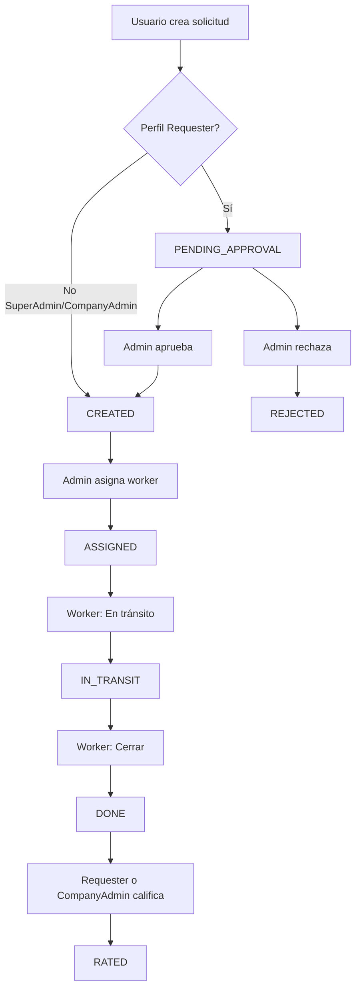

# Documentación Funcional - MG Request

## 1. Introducción y propósito

MG Request es un sistema de gestión de solicitudes de servicio que permite registrar, aprobar, asignar, ejecutar y calificar solicitudes de trabajo en distintos sitios de empresas cliente.

**Alcance de esta documentación**: describe las funcionalidades del producto, los perfiles de usuario, las opciones disponibles para cada perfil y los flujos de trabajo principales. El documento está orientado a usuarios finales, analistas funcionales y equipos de soporte.

---

## 2. Perfiles y roles

El sistema define cuatro perfiles de usuario con distintos niveles de acceso:

| ID | Perfil | Descripción |
|----|--------|-------------|
| 1 | Super Admin | Acceso total al sistema. Puede gestionar empresas, sitios, categorías, subcategorías, perfiles, personas y usuarios. Ve todas las solicitudes y realiza todas las acciones. |
| 2 | Requester | Crea solicitudes de servicio, visualiza sus propias solicitudes y puede interactuar con ellas (por ejemplo, calificar una vez completadas). Sus solicitudes requieren aprobación previa. |
| 3 | Company Admin | Mismo que Requester, más la gestión de Personas y Usuarios de su empresa, y acceso a Sites. Solo ve y opera dentro de los datos de su company. |
| 4 | Worker | Usuario con rol de empleado asignado a sitios. Solo visualiza las solicitudes asignadas a él. No puede crear nuevas solicitudes. Ejecuta el trabajo y marca las solicitudes como completadas. |

**Nota**: El atributo "Employee" es una propiedad del registro Persona (Customer con `employee=true`). Se utiliza para mostrar la pestaña "Asignadas a mí" en la lista de solicitudes y para listar los trabajadores disponibles al asignar una solicitud.

---

## 3. Opciones de menú por perfil

Tras la migración V6, el menú se configura dinámicamente según el perfil del usuario. Las opciones visibles son:

| Opción | Super Admin | Requester | Company Admin | Worker |
|--------|:-----------:|:---------:|:-------------:|:------:|
| Home | Sí | Sí | Sí | Sí |
| Requests | Sí | Sí | Sí | Sí |
| New Request | Sí | Sí | Sí | No |
| Companies | Sí | No | No | No |
| Sites | Sí | No | Sí | No |
| Service categories | Sí | No | No | No |
| Service subcategories | Sí | No | No | No |
| Profiles | Sí | No | No | No |
| Persons | Sí | No | Sí | No |
| Users | Sí | No | Sí | No |

**Resumen por perfil**:
- **Super Admin**: Acceso a todas las opciones del menú.
- **Requester**: Solo bloque Principal (Home, Requests, New Request).
- **Company Admin**: Principal + Catálogos (solo Sites) + Admin (Persons, Users). No tiene Companies, Service categories, Service subcategories ni Profiles.
- **Worker**: Solo Principal (Home, Requests). No tiene New Request.

---

## 4. Descripción funcional de cada opción

### Home (/)
Pantalla de bienvenida que muestra un saludo personalizado y acceso rápido a las opciones del menú. Los enlaces se generan dinámicamente según el perfil del usuario.

### Requests (/requests)
Listado de solicitudes con:
- **Tabs**: Según el perfil, el usuario puede ver "Todas las solicitudes", "Mis solicitudes" o "Asignadas a mí".
- **Filtros**: Por estado, prioridad y empresa.
- **Acciones**: Acceso al detalle de cada solicitud para ver información y ejecutar acciones según el estado.

Los administradores (Super Admin y Company Admin) ven el tab "Todas las solicitudes" (o "Mis solicitudes" en su company) más "Asignadas a mí" si son employees. Requester y Worker ven "Mis solicitudes" y, si son employees, también "Asignadas a mí".

### New Request (/requests/new)
Formulario para crear una nueva solicitud. Campos:
- **Sitio**: Sitio donde se requiere el servicio (obligatorio).
- **Categoría**: Categoría de servicio (obligatorio).
- **Subcategoría**: Subcategoría de servicio (opcional).
- **Descripción**: Detalle de la solicitud (obligatorio).
- **Prioridad**: Baja (L), Media (M) o Alta (H).

No disponible en el menú para Worker.

### Companies (/companies)
CRUD de empresas. Solo Super Admin puede crear, editar y eliminar. Company Admin recibe error 403 si intenta modificar.

### Sites (/sites)
CRUD de sitios. Super Admin ve todos; Company Admin puede gestionar sitios (el backend no restringe por company en la API actual). Cada sitio pertenece a una empresa.

### Service categories (/service-categories)
CRUD de categorías de servicio. Solo Super Admin puede crear, editar y eliminar. Company Admin recibe 403 en operaciones de escritura.

### Service subcategories (/service-sub-categories)
CRUD de subcategorías de servicio. Solo Super Admin puede crear, editar y eliminar. Company Admin recibe 403 en operaciones de escritura.

### Profiles (/admin/profiles)
CRUD de perfiles de usuario. Solo Super Admin puede acceder.

### Persons (/admin/customers)
CRUD de personas (registros Customer). Cada persona tiene nombre, apellido, email, teléfono, empresa y flag de empleado.
- Super Admin: gestiona todas las personas.
- Company Admin: solo personas de su empresa; el frontend fuerza el companyId al crear/editar.

### Users (/admin/users)
CRUD de usuarios. Cada usuario se asocia a una persona, un perfil y un sitio (opcional).
- Super Admin: gestiona todos los usuarios.
- Company Admin: solo usuarios vinculados a personas de su empresa.

### Change password (/change-password)
Cualquier usuario autenticado puede cambiar su propia contraseña ingresando la contraseña actual y la nueva. El cambio de contraseña de otro usuario solo está disponible para Super Admin vía API (no expuesto en la interfaz estándar).

---

## 5. Flujo principal: Solicitudes (Request)

### Estados de una solicitud

| Estado | Descripción |
|--------|-------------|
| PENDING_APPROVAL | Solicitud creada por Requester; pendiente de aprobación. |
| CREATED | Solicitud aprobada o creada directamente por Admin; lista para asignar. |
| ASSIGNED | Worker asignado; pendiente de que inicie el trabajo. |
| IN_TRANSIT | Worker en camino o ejecutando el trabajo. |
| DONE | Trabajo completado; pendiente de calificación. |
| RATED | Calificada por el requester o Company Admin. |
| REJECTED | Rechazada por un admin. |

### Diagrama del flujo

### Pasos detallados

1. **Crear solicitud**  
   Requester, Company Admin o Super Admin accede a New Request, completa el formulario (Sitio, Categoría, Subcategoría, Descripción, Prioridad) y envía.

2. **Estado inicial según perfil**
   - Si el creador es **Requester**: la solicitud queda en **PENDING_APPROVAL**. Se envía un email a los administradores de la empresa del sitio.
   - Si el creador es **Super Admin** o **Company Admin**: la solicitud queda en **CREATED** directamente.

3. **Aprobación o rechazo** (solo si estado es PENDING_APPROVAL)
   - Admin (Super Admin o Company Admin) abre el detalle de la solicitud.
   - Puede **Aprobar** → pasa a CREATED, o **Rechazar** → pasa a REJECTED.
   - El Requester recibe email según la acción realizada.

4. **Asignación** (estado CREATED)
   - Admin abre el detalle de la solicitud.
   - Ejecuta "Asignar a personal", selecciona un worker de la lista y confirma.
   - La solicitud pasa a ASSIGNED.
   - El worker asignado recibe un email de notificación.

5. **Ejecución por el Worker**
   - El worker ve la solicitud en la pestaña "Asignadas a mí".
   - Ejecuta "En tránsito" (ASSIGNED → IN_TRANSIT).
   - Al terminar el trabajo, ejecuta "Cerrar" con un comentario opcional (IN_TRANSIT → DONE).
   - El Requester recibe email al completarse.

6. **Calificación** (estado DONE)
   - El Requester o el Company Admin de la misma empresa puede calificar la solicitud.
   - Selecciona una puntuación (estrellas) y opcionalmente un comentario.
   - La solicitud pasa a RATED.

7. **Fin del flujo**  
   Estados finales: RATED (completada y calificada) o REJECTED (rechazada).

---

## 6. Flujo de asignación

1. El admin (Super Admin o Company Admin) abre el detalle de una solicitud en estado **CREATED**.
2. Se muestra el botón "Asignar a personal".
3. Al hacer clic, aparece un selector con la lista de workers (usuarios cuyo Customer tiene `employee=true`).
4. El admin selecciona un worker y confirma la asignación.
5. El sistema:
   - Crea el registro de asignación (RequestAssignment).
   - Cambia el estado de la solicitud a ASSIGNED.
   - Envía un email al worker asignado con los detalles de la solicitud.
6. El worker pasa a ver la solicitud en la pestaña "Asignadas a mí" y puede seguir el flujo (En tránsito → Cerrar).

---

## 7. Flujo de Personas y Usuarios (Company Admin)

### Personas (Persons)

1. Company Admin accede a la opción Persons en el menú.
2. Ve solo las personas de su empresa.
3. Al crear una nueva persona, el frontend fuerza automáticamente el companyId de la empresa del admin (no hay selector de empresa).
4. Al editar, solo puede modificar personas de su empresa.
5. Puede marcar a una persona como empleado (employee) para que aparezca en la lista de workers al asignar solicitudes.

### Usuarios (Users)

1. Company Admin accede a la opción Users en el menú.
2. Ve solo los usuarios vinculados a personas de su empresa.
3. Al crear un usuario, debe asociarlo a una persona de su empresa.
4. Puede asignar perfil (Requester, Worker, Company Admin para su empresa, etc.), sitio y persona.
5. No puede gestionar usuarios de otras empresas.

---

## 8. Otros flujos

### Cambio de contraseña propia

1. Cualquier usuario autenticado accede a "Mi cuenta" o directamente a `/change-password`.
2. Ingresa la contraseña actual, la nueva y la confirmación.
3. La contraseña nueva debe tener al menos 4 caracteres.
4. Si la contraseña actual es correcta, la contraseña se actualiza.

### Cambio de contraseña de otro usuario

Solo el Super Admin puede cambiar la contraseña de otro usuario mediante la API `PUT /api/users/{id}/password`. Esta funcionalidad no está expuesta en la interfaz estándar del SPA.

---

## 9. Visibilidad de solicitudes por perfil

| Perfil | Endpoint | Descripción |
|--------|----------|-------------|
| Super Admin | GET /api/requests | Últimas 100 solicitudes de todo el sistema. |
| Company Admin | GET /api/requests | Últimas 100 solicitudes de los sitios de su empresa. |
| Requester / Worker (no admin) | GET /api/requests/my | Solicitudes creadas por el usuario (donde userId = id del usuario). |
| Worker (employee) | GET /api/requests/assigned | Solicitudes asignadas al usuario. |
| Cualquier usuario | GET /api/requests/{id} | Detalle de una solicitud; el backend no restringe el acceso por perfil si el usuario está autenticado. |

---

## 10. Reglas de negocio y restricciones

1. **Requester**: Las solicitudes creadas por Requester siempre comienzan en PENDING_APPROVAL y deben ser aprobadas o rechazadas por un admin.
2. **Super Admin / Company Admin**: Las solicitudes creadas por estos perfiles comienzan directamente en CREATED.
3. **Calificación**: Solo el Requester o el Company Admin de la empresa del sitio pueden calificar. La solicitud debe estar en estado DONE. El campo `canRate` en el DTO indica si el usuario actual puede calificar.
4. **Company Admin**: Recibe 403 (Forbidden) en create/update/delete de Companies, Service categories y Service subcategories.
5. **Cambio de contraseña de otro usuario**: Solo Super Admin, vía API.
6. **Personas y Usuarios**: Company Admin solo puede gestionar registros de su empresa.
7. **Workers en asignación**: La API `/api/users/workers` devuelve todos los usuarios con Customer `employee=true` del sistema (sin filtrar por empresa del sitio de la solicitud).
